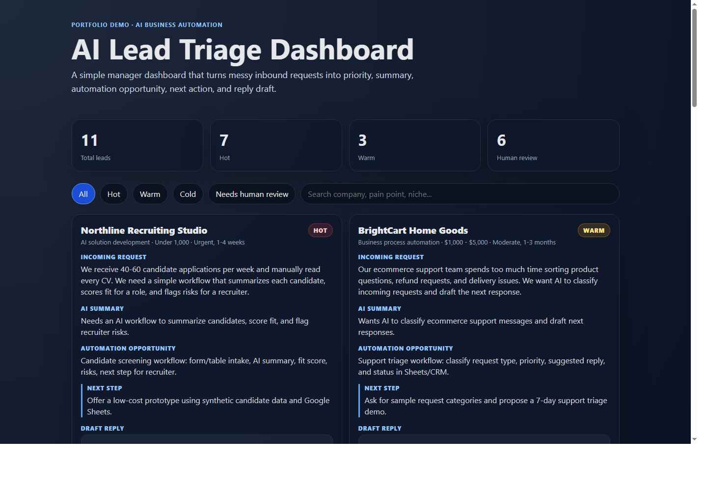

# AI Lead Triage Dashboard

Static manager dashboard for reviewing AI-enriched inbound leads.



## What It Shows

The dashboard turns raw business requests into:

- lead priority
- short summary
- likely pain points
- automation opportunity
- recommended action
- draft reply
- human-review status

## Workflow

```text
Incoming request -> AI analysis -> structured lead data -> manager dashboard
```

## Features

- Filterable lead cards by priority and human-review status
- Search across company, message, niche, and pain points
- Synthetic demo dataset with realistic business requests
- Static HTML/CSS/JavaScript implementation

## Files

- `index.html` - dashboard demo
- `data/demo-leads.json` - synthetic enriched leads
- `assets/dashboard-screenshot.png` - dashboard screenshot
- `docs/outreach-message.md` - short outreach examples used for validation
