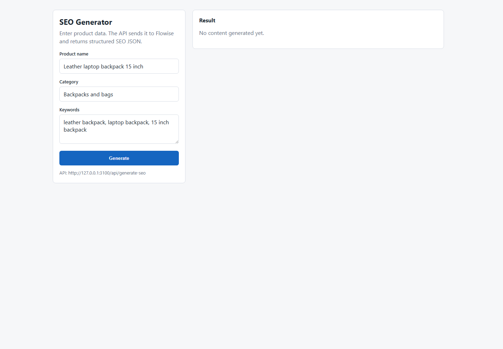

# SEO Product Description Generator

Portfolio case study: a browser demo and local API that turn basic product data into structured SEO content for ecommerce.

Demo video: https://drive.google.com/file/d/1qpDJuROJc4sSyifRTpW7PbEL2YqJJb51/view?usp=drive_link



## Problem

Ecommerce teams often need product titles, meta descriptions, H1 headings, descriptions, and bullet points at scale. Writing each item manually is slow and inconsistent.

## Solution

The demo accepts:

- product name
- category
- keywords

It returns structured SEO fields:

- `title`
- `meta_description`
- `h1`
- `description`
- `bullets`

## Workflow

```text
Browser demo -> NestJS API -> Flowise -> Ollama -> structured SEO output
```

## Stack

- Flowise for AI workflow orchestration
- Ollama for local LLM execution
- NestJS for the API boundary
- HTML/CSS/JavaScript for the browser demo
- NDJSON streaming for API responses

## Repository Structure

```text
demo.html                     Browser demo
api/                          NestJS endpoint
flowise/chatflow-export.json  Flowise chatflow export
ollama/apertus-tools-seo.Modelfile
docs/architecture.md
docs/edge-cases.md
docs/video-script.md
```

## Run Locally

Create the Ollama model alias:

```powershell
ollama create apertus-tools-seo -f .\ollama\apertus-tools-seo.Modelfile
```

Start the API:

```powershell
cd .\api
npm install
npm run build
npm start
```

Open:

```text
demo.html
```
